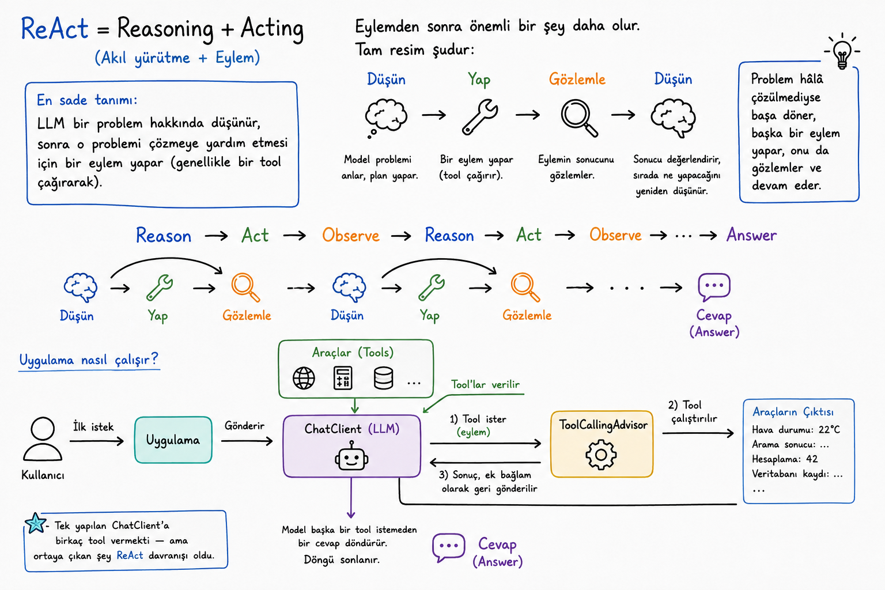

# ReAct Pattern

## ReAct Nedir?

**ReAct**, **Reasoning + Acting** yani **Akıl Yürütme + Eylem** anlamına gelir.

En sade haliyle model:

1. Bir problem hakkında düşünür.
2. Problemi çözmesine yardımcı olacak bir eylem gerçekleştirir. Bu eylem genellikle bir tool çağrısıdır.
3. Eylemin sonucunu gözlemler.
4. Sonuca göre sırada ne yapacağını yeniden düşünür.

## ReAct Döngüsü

ReAct yalnızca düşünmek ve eyleme geçmekten oluşmaz. Model, yaptığı eylemin sonucunu da değerlendirir:

```text
Düşün → Yap → Gözlemle → Düşün
Reason → Act → Observe → Reason
```

Problem henüz çözülmediyse model döngüyü tekrarlar, başka bir eylem gerçekleştirir ve yeni sonucu gözlemler:

```text
Reason → Act → Observe → Reason → Act → Observe → ... → Answer
```

Bu döngü, model problemi çözüp nihai cevabı verene kadar devam eder.

## Spring AI'da Nasıl Çalışır?

Uygulama, kullanıcının ilk isteğini `ChatClient` aracılığıyla modele gönderir.

Model bir tool kullanmak isterse `ToolCallingAdvisor`:

1. İstenen tool'un çalıştırılmasını sağlar.
2. Tool'dan dönen sonucu konuşma bağlamına ekler.
3. Güncellenen bağlamı modele geri gönderir.

Model böylece sonucu gözlemler ve sırada ne yapacağını yeniden düşünür. Yeni bir tool'a ihtiyaç duyarsa başka bir çağrı yapar. Başka bir tool istemeden cevap ürettiğinde döngü tamamlanır.

## Özet

Uygulama tarafında yapılan temel işlem, `ChatClient`'a kullanabileceği tool'ları vermektir. Modelin tool çağırması, sonucu gözlemlemesi ve bu sonuca göre yeniden düşünmesi ise ortaya ReAct davranışını çıkarır.


